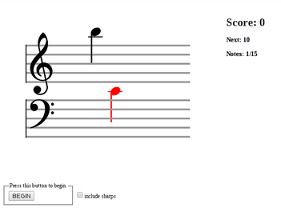

# Piano flash card app/game/trash.

Inspired by this $6 paper note recognition thing that my daughter uses.

The heavy lifting is done by Wad (https://github.com/rserota/wad) and VexFlow (https://github.com/0xfe/vexflow).

My implementation here is pretty horrendous, but it's good starting point, and hopefully it can save someone else a few hours of research when trying to get started with something similar.

You can see it in action here, if I haven't taken it down yet:

http://burke.se/piano-flash/index.html

Only tested in Chrome on Linux/Android, and probably doesn't work elsewhere.

It's worth noting that due to the way Wad works (or maybe web audio in general) you must run this from a web server or it won't work properly.

Hooray.

-Sam
